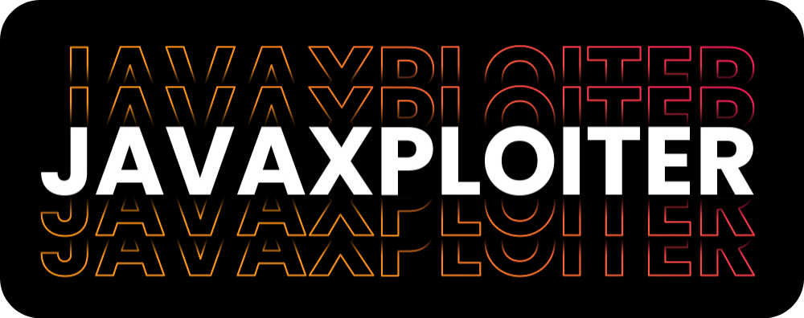

# Hey There! I'm [Java](https://github.com/JawaTengahXploit1337) 👋

I'm a passionate developer with expertise in various programming languages and technologies. I enjoy creating innovative solutions and sharing my knowledge with the community. Welcome to my GitHub profile!

## ⚡ Technologies

## 🌟 GitHub Streak

  

    
    
  

  

  

    <h2>👋 About Me</h2>
    
Hello, I am XiaomingX. I have a general understanding of cryptography, machine learning, compiler theory, and computer graphics.

    
👀 I am currently very interested in GPU programming, browser-side model optimization, and deployment.

    
🌱 I am currently engaged in front-end plugin development work.

    
💞️ Welcome to submit any PRs to my error-filled projects.

    
📫 You can contact me through X, or follow me on GitHub to get the latest updates on my work.

    
🌑 I code at midnight, please do not disturb me during this time.

  

  

## 🌐 Connect with Me

Feel free to reach out if you want to collaborate on projects, discuss technology, or just chat!

[![BuyMeCoffee][buymecoffeebadge]][buymecoffee]

[buymecoffee]: https://saweria.co/AsmaraHancur
[buymecoffeebadge]: https://img.shields.io/badge/buy%20me%20a%20coffe-donate-yellow.svg?style=for-the-badge
[commits-shield]: https://img.shields.io/github/commit-activity/y/audiconnect/audi_connect_ha?style=for-the-badge

